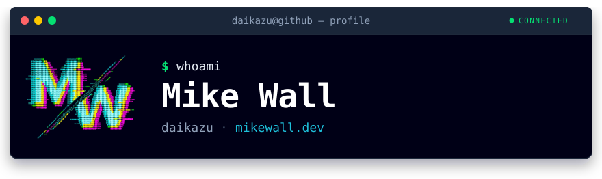
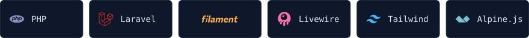

I'm currently a senior software engineer at a large promotional product company, where I build and maintain web applications, internal productivity tools, and business intelligence (BI) systems that help teams work faster and make better decisions.

I love creating tools that solve real problems. If any of my work has helped you out, feel free to star a repo. Ideas, feature requests, and PRs are welcome — I'm always happy to chat!

<picture>
  <source media="(prefers-color-scheme: dark)" srcset="assets/h-stack-dark.svg">
  
</picture>

<picture>
  <source media="(prefers-color-scheme: dark)" srcset="assets/h-shipped-dark.svg">
  
</picture>

#### Laravel packages

| Project | Installs | What it does |
| --- | --- | --- |
| [**laravel-glider**](https://github.com/daikazu/laravel-glider) |  | Use Glide image manipulation on-the-fly in Laravel Blade templates |
| [**bladewind**](https://github.com/daikazu/bladewind) **new** |  | Per-page CSS for Laravel Blade, split from your existing Vite build |
| [**flexicart**](https://github.com/daikazu/flexicart) |  | A simple, flexible shopping cart package for Laravel |
| [**laravel-frontdoor**](https://github.com/daikazu/laravel-frontdoor) |  | Driver-based passwordless login for Laravel |
| [**eloquent-salesforce-objects**](https://github.com/daikazu/eloquent-salesforce-objects) |  | Eloquent-style interface for working with Salesforce objects |
| [**laratone**](https://github.com/daikazu/laratone) |  | Simple API for managing color libraries in Laravel |
| [**asset-cleaner**](https://github.com/daikazu/asset-cleaner) |  | Clean unused assets from your Laravel app |

#### Filament plugins

| Project | Installs | What it does |
| --- | --- | --- |
| [**filament-image-checkbox-group**](https://github.com/daikazu/filament-image-checkbox-group) |  | Image-based checkbox group component for FilamentPHP |
| [**filament-lightbox**](https://github.com/daikazu/filament-lightbox) |  | Lightbox to preview images in FilamentPHP |

#### SEO & site plumbing

| Project | Installs | What it does |
| --- | --- | --- |
| [**laravel-llm-ready**](https://github.com/daikazu/laravel-llm-ready) |  | Serve LLM-optimized markdown versions of your Laravel pages |
| [**sitemap**](https://github.com/daikazu/sitemap) |  | Automatically generate your website's sitemap |
| [**robotstxt**](https://github.com/daikazu/robotstxt) |  | Dynamic robots.txt for your Laravel app |
| [**social-links**](https://github.com/daikazu/social-links) |  | Quickly generate social profile links in your Laravel project |

#### Beyond PHP

| Project | Installs | What it does |
| --- | --- | --- |
| [**rybbit-mcp-server**](https://github.com/daikazu/rybbit-mcp-server) · [npm](https://www.npmjs.com/package/rybbit-mcp-server) |  | MCP server for interacting with the Rybbit Analytics API |

---

📈 [Code::Stats](https://codestats.net/users/Daikazu)

Yes, I use em dashes — I was using them before the LLMs made it weird. I refuse to let the robots take this from me. (On Mac: <kbd>Option</kbd> + <kbd>Shift</kbd> + <kbd>-</kbd>. Join the resistance.)
